# Twin Delayed Deep Deterministic Policy Gradient (TD3)

## Overview

This repository contains a PyTorch implementation of Twin Delayed Deep Deterministic Policy Gradients (TD3), a reinforcement learning algorithm that addresses some of the key challenges associated with continuous control tasks. The TD3 algorithm builds on the foundation of Deep Deterministic Policy Gradients (DDPG) by introducing several improvements to enhance stability and performance. One of the primary motivations behind TD3 is to mitigate the overestimation bias in Q-learning, which can lead to suboptimal policies. To achieve this, the authors proposed using a pair of critic networks to provide more accurate Q-value estimates. Additionally, TD3 employs a delayed policy update strategy, which reduces the variance in policy updates and helps in achieving more robust learning. Finally, the introduction of target policy smoothing adds noise to the target action, which reduces the likelihood of policy exploitation due to function approximation errors.  


## Setup

### Required Dependencies

Install the required dependencies using the following command:

```bash
pip install -r requirements.txt
```

### Running the Algorithm

You can run the algorithm on any supported Gymnasium environment. For example:

```bash
python main.py --env 'LunarLanderContinuous-v2'
```

No hyperparameter tuning was conducted for the various environments. This was an intentional choice to compare the generalization of the algorithm to different tasks. For this reason, the agent successfully learn in some cases, and in others was still training after 10,000 epochs. 

<table>
    <tr>
        <td>
            <p><b>Pendulum-v1</b></p>
            
        </td>
        <td>
            <p><b>LunarLanderContinuous-v2</b></p>
            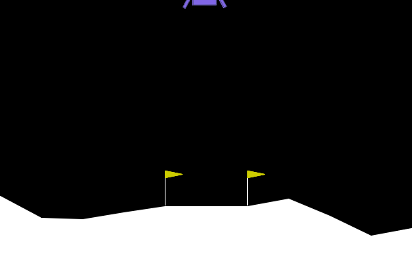
        </td>
        <td>
            <p><b>MountainCarContinuous-v0</b></p>
            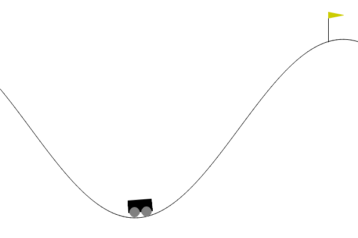
        </td>
    </tr>
    <tr>
        <td>
            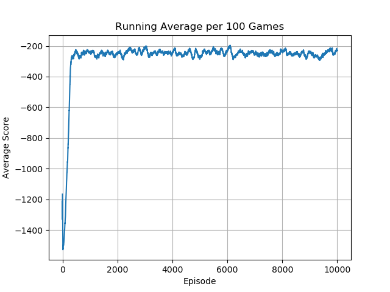
        </td>
        <td>
            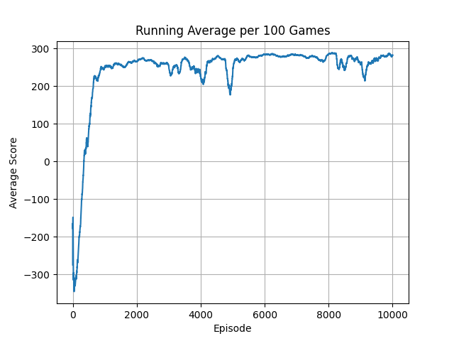
        </td>
        <td>
            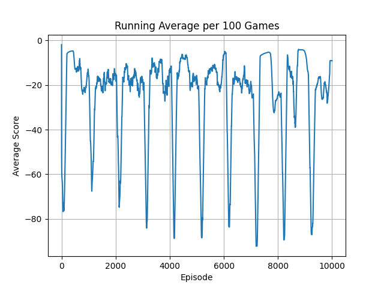
        </td>
    </tr>
</table>
<table>
    <tr>
        <td>
            <p><b>BipedalWalker-v3</b></p>
            
        </td>
        <td>
            <p><b>Hopper-v4</b></p>
            
        </td>
        <td>
            <p><b>Humanoid-v4</b></p>
            
        </td>
    </tr>
    <tr>
        <td>
            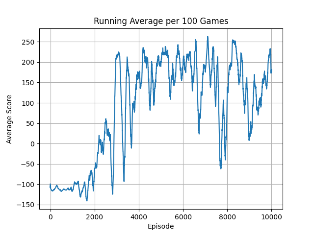
        </td>
        <td>
            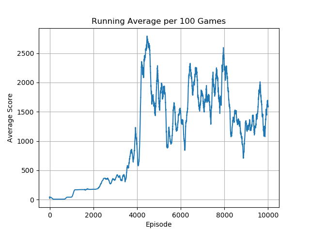
        </td>
        <td>
            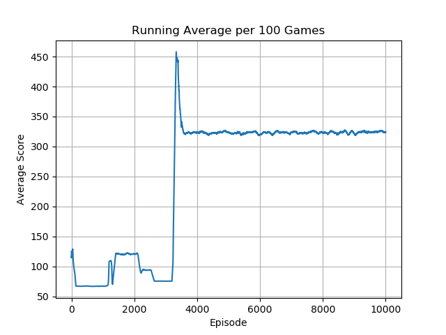
        </td>
    </tr>
</table>
<table>
    <tr>
        <td>
            <p><b>Ant-v4</b></p>
            
        </td>
        <td>
            <p><b>HalfCheetah-v4</b></p>
            
        </td>
        <td>
            <p><b>HumanoidStandup-v4</b></p>
            
        </td>
    </tr>
    <tr>
        <td>
            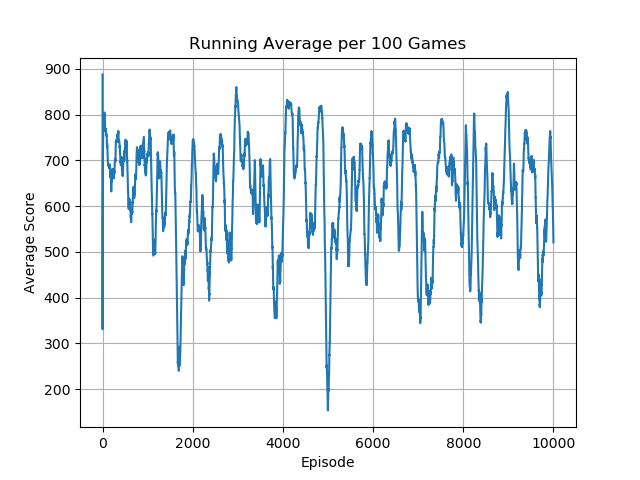
        </td>
        <td>
            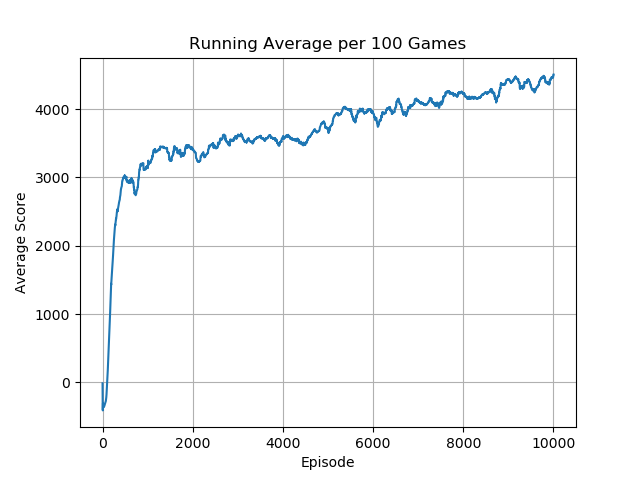
        </td>
        <td>
            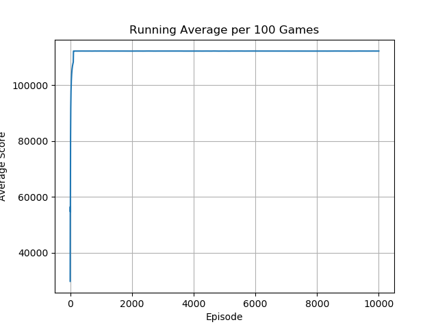
        </td>
    </tr>
</table>
<table>
    <tr>
        <td>
            <p><b>InvertedDoublePendulum-v4</b></p>
            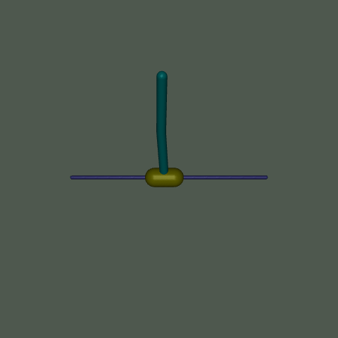
        </td>
        <td>
            <p><b>InvertedPendulum-v4</b></p>
            
        </td>
        <td>
            <p><b>Pusher-v4</b></p>
            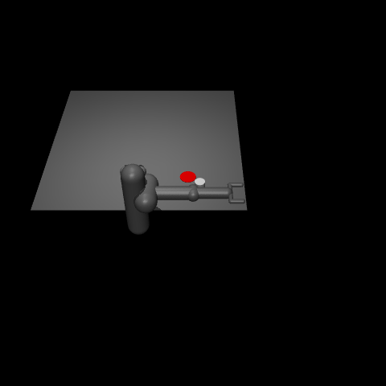
        </td>
    </tr>
    <tr>
        <td>
            
        </td>
        <td>
            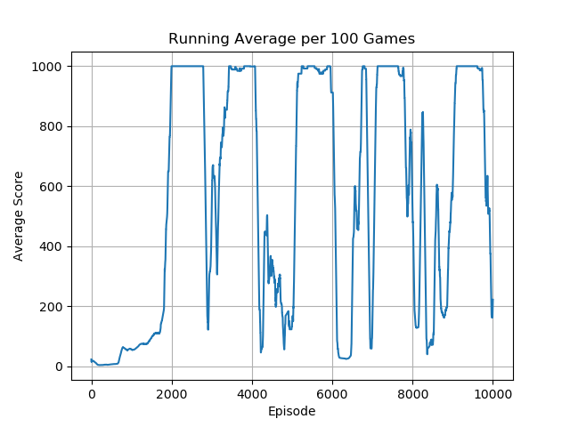
        </td>
        <td>
            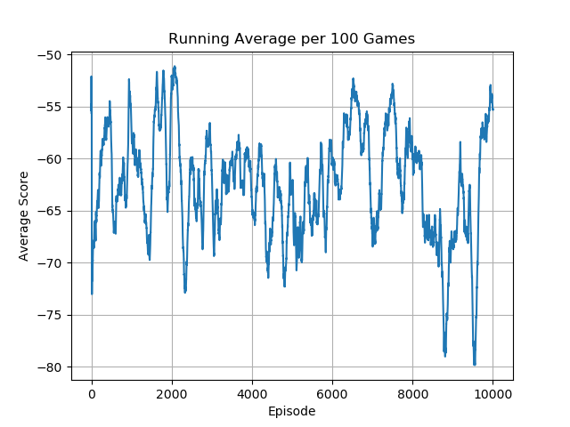
        </td>
    </tr>
</table>
<table>
    <tr>
        <td>
            <p><b>Reacher-v4</b></p>
            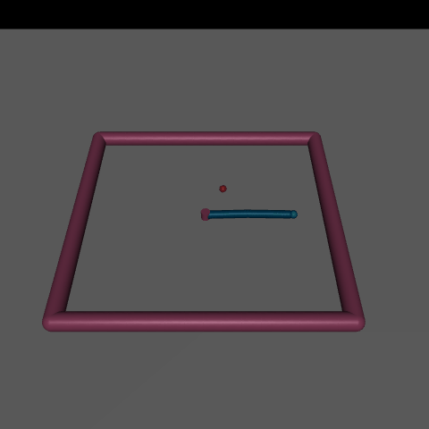
        </td>
        <td>
            <p><b>Swimmer-v3</b></p>
            
        </td>
        <td>
            <p><b>Walker2d-v4</b></p>
            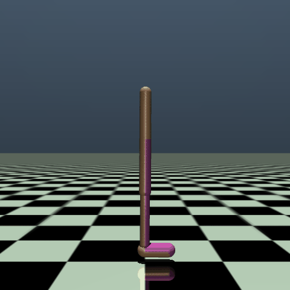
        </td>
    </tr>
    <tr>
        <td>
            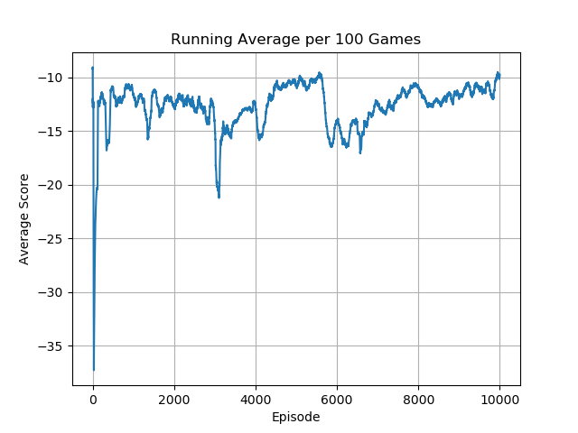
        </td>
        <td>
            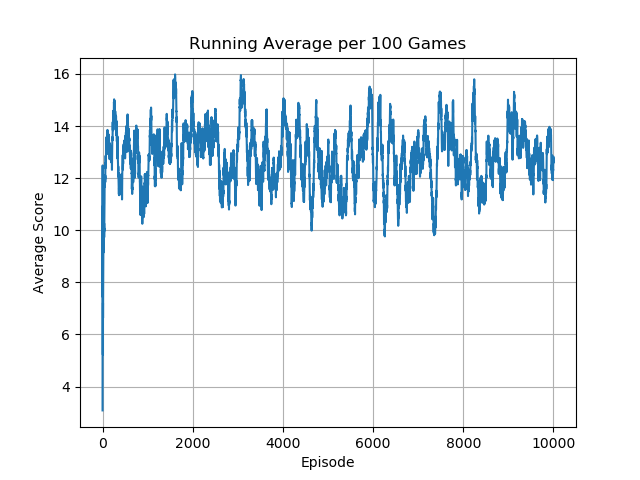
        </td>
        <td>
            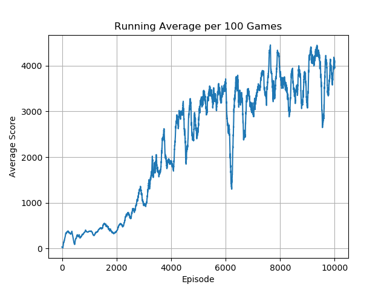
        </td>
    </tr>
</table>

## Acknowledgements

Special thanks to Phil Tabor, an excellent teacher! I highly recommend his [Youtube channel](https://www.youtube.com/machinelearningwithphil).
