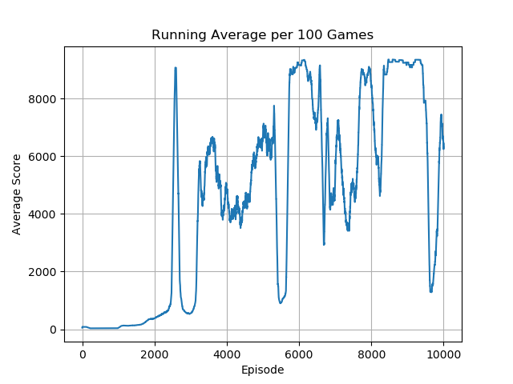

# Twin Delayed Deep Deterministic Policy Gradient (TD3)

## Overview

🚧 🛠️👷‍♀️ 🛑 Under construction...

## Setup

### Required Dependencies

Install the required dependencies using the following command:

```bash
pip install -r requirements.txt
```

### Running the Algorithm

You can run the algorithm on any supported Gymnasium environment. For example:

```bash
python main.py --env 'LunarLanderContinuous-v2'
```
<!-- 
---

<table>
    <tr>
        <td>
            <p><b>CartPole-v1</b></p>
            
        </td>
        <td>
            <p><b>MountainCar-v0</b></p>
            
        </td>
        <td>
            <p><b>Acrobot-v1</b></p>
            
        </td>
    </tr>
    <tr>
        <td>
            
        </td>
        <td>
            
        </td>
        <td>
            
        </td>
    </tr>
</table>
<table>
    <tr>
        <td>
            <p><b>LundarLander-v2</b></p>
            
        </td>
        <td>
            <p><b>Asteroids-v5</b></p>
            
        </td>
        <td>
            <p><b>Breakout-v5</b></p>
            
        </td>
    </tr>
    <tr>
        <td>
            
        </td>
        <td>
            
        </td>
        <td>
            
        </td>
    </tr>
</table>
<table>
    <tr>
        <td>
            <p><b>BeamRider-v5</b></p>
            
        </td>
        <td>
            <p><b>Centipede-v5</b></p>
            
        </td>
        <td>
            <p><b>DonkeyKong-v5</b></p>
            
        </td>
    </tr>
    <tr>
        <td>
            
        </td>
        <td>
            
        </td>
        <td>
            
        </td>
    </tr>
</table>
<table>
    <tr>
        <td>
            <p><b>Frogger-v5</b></p>
            
        </td>
        <td>
            <p><b>KungFuMaster-v5</b></p>
            
        </td>
        <td>
            <p><b>MarioBros-v5</b></p>
            
        </td>
    </tr>
    <tr>
        <td>
            
        </td>
        <td>
            
        </td>
        <td>
            
        </td>
    </tr>
</table>
<table>
    <tr>
        <td>
            <p><b>MsPacman-v5</b></p>
            
        </td>
        <td>
            <p><b>SpaceInvaders-v5</b></p>
            
        </td>
        <td>
            <p><b>Tetris-v5</b></p>
            
        </td>
    </tr>
    <tr>
        <td>
            
        </td>
        <td>
            
        </td>
        <td>
            
        </td>
    </tr>
</table>

It's very interesting that PPO struggles to solve the MountainCar environment (solved easily by DDPG). I found this comment from `/u/jurniss` on Reddit very insightful:

> Sparse rewards. In OpenAI Gym MountainCar you only get a positive reward when  you reach the top. PPO is an on-policy algorithm. It performs a policy gradient update after each episode and throws the data away. Reaching the goal in MountainCar by random actions is a pretty rare event. When it finally happens, it's very unlikely that a single policy gradient update will be enough to start reaching the goal consistently, so PPO gets stuck again with no learning signal until it reaches the goal again by chance. On the other hand, DDPG stores this event in the replay buffer so it does not forget. The TD bootstrapping of the Q function will eventually propagate the reward from the goal backwards into the Q estimate for other states near the goal This is a big advantage of off-policy RL algorithms. Also DDPG uses an Ornstein-Uhlenbeck process for time-correlated exploration, whereas PPO samples Gaussian noise. The Ornstein-Uhlenbeck process is more likely to generate useful exploratory actions. (The exploration methods are not immutable properties of the algorithms, just the Baselines implementations.)

--- -->

## Acknowledgements

Special thanks to Phil Tabor, an excellent teacher! I highly recommend his [Youtube channel](https://www.youtube.com/machinelearningwithphil).
